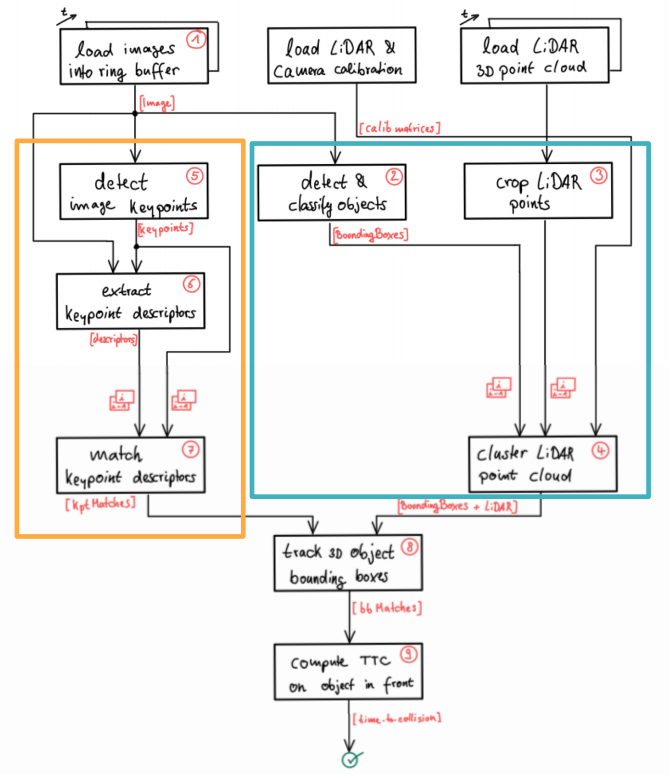
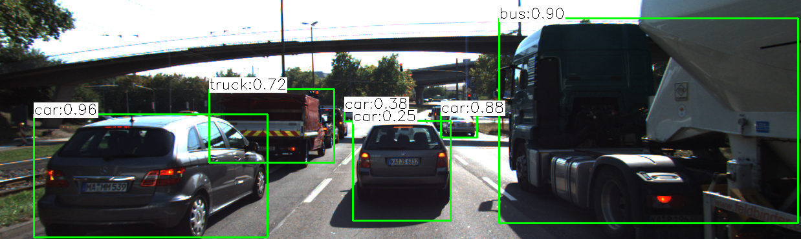
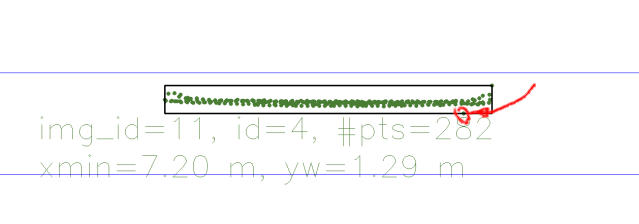
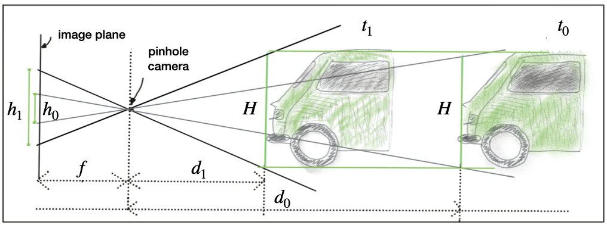
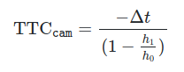

# 3D Object Tracking
## Sensor Fusion Engineer Nanodegree

This project aims to build prototypal components of the vehicle collision avoidance system utilizing 
LiDAR and Camera sensors and tune the parameters of these components. A Time-to-Collision (TTC) to 
the vehicle ahead is calculated separately from the LiDAR and Camera data, and an accuracy analysis 
justifies the choice of parameters.

The architecture of the system built is presented in the following picture.

#### LiDAR-derived TTC

The YOLOv3 neural network is at the core of the "detect and classify objects" step (rectangle #2 in the picture above). 
It is famous for its ability to detect and classify objects quickly while also having a reasonable accuracy.
The code corresponding to this step resides in the function `detectObjects` from the 
[objectDetection2D.cpp](src/objectDetection2D.cpp) file.

The `cropLidarPoints` function from the [lidarData.cpp](src/lidarData.cpp)  represents the "crop LiDAR points" 
step from the system architecture diagram. It removes the LiDAR points that do not belong to the lane in which 
the ego vehicle is. It is peculiar to the selected dataset and cannot be used as is in a real product.

The `clusterLidarWithROI` function from the [camFusion_Student.cpp](src/camFusion_Student.cpp) file is responsible 
for creating groups of LiDAR points whose projection into the camera image falls into the same bounding boxes 
produced by the YOLOv3. It implements the "cluster LiDAR point cloud" step from the system diagram 
(rectangle #3 in the picture above).

The matching of bounding boxes from the previous and the current frames corresponding to the vehicle ahead will 
be described in the section [Camera-derived TTC](#camera-derived-ttc) as it provides a better context to 
facilitate understanding of the algorithm.

The LiDAR-derived TTC is calculated using the function `computeTTCLidar` from the file 
[camFusion_Student.cpp](src/camFusion_Student.cpp). To avoid severe estimation errors and make such estimations 
more robust, the following approach has been adapted:
- Take the bounding boxes corresponding to the car ahead for the previous and the current frames and 
  all the LiDAR points projected into it.
- For both the previous and the current bounding boxes, disregard the closest 5 points, 
  take the next 5 points (6th to 10th), average their X-coordinates (X-axis is along the lane).
- Having a fixed frequency of LiDAR measurements, compute the speed with which the ego vehicle approaches the car ahead.
- Knowing the current distance to the car ahead and the current approach speed, one could calculate the TTC 
  by dividing the current distance by the current speed.

The following is a top-down view of the LiDAR points projected onto the car's rear bumper driving in front. 
It has one outlier that, if not filtered, will have produced a TTC estimation that is significantly 
off the actual value.

The LiDAR-derived TTC calculation happens in the "compute TTC on object in front" step from the system diagram 
(rectangle #9 in the picture above).

#### Camera-derived TTC

The detection of image keypoints happens in the function(s) ` detKeypoints*` from the file 
[matching2D_Student.cpp](src/matching2D_Student.cpp) and corresponds to the step "detect image keypoints" 
from the system diagram (rectangle #5 in the picture above).

The calculation of keypoints descriptors happens in the function `descKeypoints` from the file 
[matching2D_Student.cpp](src/matching2D_Student.cpp) and corresponds to the step "extract keypoint descriptors" 
from the system diagram (rectangle #6 in the picture above).

The matching of keypoint descriptors from the previous and the current frames is done in the function 
`matchDescriptors` from the file [matching2D_Student.cpp](src/matching2D_Student.cpp). 
It corresponds to the step "match keypoint descriptors" from the system diagram (rectangle #7 in the picture above).

The next step is to associate the keypoints that matched previously with the bounding boxes. 
It is handled in the function `findBoundingBoxesContainingKeypoint` from the 
[camFusion_Student.cpp](src/camFusion_Student.cpp) file. This keypoints association with bounding boxes is 
the first part of the "track 3D object bounding boxes" step from the system diagram (rectangle #8 in the picture above).

The matching of bounding boxes from the previous and the current frames corresponding to the vehicle ahead is done
in the `matchBoundingBoxes` function from the file [camFusion_Student.cpp](src/camFusion_Student.cpp).
The bounding boxes between the current and the previous frames are associated based on the number of matches between
the key points lying inside corresponding bounding boxes. Which points are lying inside which boxes is determined by 
the function `findBoundingBoxesContainingKeypoint` from the [camFusion_Student.cpp](src/camFusion_Student.cpp) file.
The pair of bounding boxes having the maximum number of matches gets chosen. This bounding box matching corresponds to
the "track 3D object bounding boxes" step from the system diagram (rectangle #8 in the picture above).

To compute the Camera-derived TTC, one first needs to associate key points with the current bounding box of the vehicle 
ahead while accounting for outlier matches and removing them from consideration. 
The function `clusterKptMatchesWithROI` from the file [camFusion_Student.cpp](src/camFusion_Student.cpp) accomplishes 
this disregarding 20% of all the keypoint pairs having the highest euclidean distances between them. 
The Camera-derived TTC is computed in the function `computeTTCCamera` from the file 
[camFusion_Student.cpp](src/camFusion_Student.cpp). The following picture defines variables that explain the formula 
for calculating the camera-derived TTC that is included after it.

  

The Camera-derived TTC calculation happens in the "compute TTC on object in front" step from the system diagram
(rectangle #9 in the picture above).

#### Accuracy Analysis

With the parameter tuning of the LiDAR-based TTC component and the choice of the most appropriate combination of 
(detector, descriptor, descriptor type, matcher, selector) for the Camera-based TTC component, 
the outlier estimates of TTC in both cases have been eliminated.

#### Building and Running

The build happens inside the docker container. The docker image is included in this repository. 
One needs to execute the `do_build.sh` script to build the project. The build artifacts will be located in the 
`cmake-build` folder.  

The generated executable has all the OpenCV-dependencies statically linked to it, 
so it can be run without the docker container, on a host, by executing the `do_run.sh` script.  

The `build_and_run.sh` script combines the build and run steps. 
